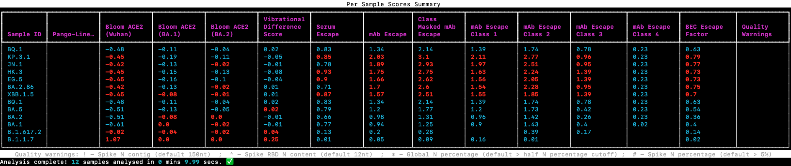

# SPEAR


# Systematic ProtEin AnnotatoR

## Introduction

SPEAR is an annotation tool for SARS-CoV-2 genomes, it provides comprehensive annotation of all protein products, in particular, Spike (S) mutations are annotated with a range of scores that provide indications of their likely effects on ACE2 binding, and likely contribution to immune escape. The aim of SPEAR is to provide a lightweight genomic surveillance tool that can be run within a diagnostic lab, sequencing facility, or analysis pipeline providing quantitative scores at point of sequencing. Functional annotation and effect scoring are derived from protein structure, theoretical simulation, and omics' experiments. 

SPEAR is capable of running on single or multiple input files and accepts a range of standard inputs, FASTA consensus sequences `.fa`, sequences aligned to reference genome (NC_045512.2|MN908947.3) `.aln` and `.vcf` files. SPEAR will annotate and score 1,000 pre-aligned input sequences in ~16 min using a single CPU core and in ~9mins with 4 cores.

The SPEAR scoring system identifies both the potential immune escape and reduced ACE2 binding consequences of variants in the Omicron RBD, as well as highlighting the potential increased stability of the open conformation of the Spike protein within Omicron, a more in-depth discussion of these matters can be found in our [preprint](https://doi.org/10.1101/2021.12.14.472622) Teruel _et al_[1].


## Installation

Clone this repo: 

`git clone https://github.com/m-crown/SPEAR.git`

Change to downloaded directory:

`cd SPEAR`

Run the install script, (this requires a working conda install, we recommend [miniconda](https://docs.conda.io/en/latest/miniconda.html)):

`install_spear`

Activate the conda environment:

`conda activate spear`

Run spear:

`spear`

Once installed SPEAR can be updated with the `spear update` command, where:

* `spear update spear` - updates the core SPEAR code and SPEAR data from this repo.
* `spear update data` - updates SPEAR data and external 3rd party datasets.
* `spear update all` - updates everything and reinstalls the conda env as well as SPEAR.

SPEAR has been tested on Mac OS 10.5, 11.x, 12.x, RHEL clones 7/8 and Ubuntu 21.10, and should work on other Linux distributions.

## Usage

SPEAR is driven by input modality so your fist argument to it should reflect the type of input files you are providing, `spear consensus` for analysis of `.fa` genome consensus files, `spear alignment` for analysis of pre-aligned consensuses in multiple FASTA format `.aln`.  And `spear vcf` for the analysis of `.vcf` files.  The reference genome used should be either [NC_045512.2](https://www.ncbi.nlm.nih.gov/nuccore/1798174254) or [MN908947.3](https://www.ncbi.nlm.nih.gov/nuccore/MN908947.3).

```
usage: spear [-h] {consensus,alignment,vcf,update,demo} ...

positional arguments:
  {consensus,alignment,vcf,update,demo}
    consensus           Run SPEAR on consensus FASTA sequence (align first).
    alignment           Run SPEAR on alignment in FASTA format (skip alignment).
    vcf                 Run SPEAR on existing VCF file(s) - skip alignment and SNP/indel identification and ambiguous SNP filtering.
    update              Update [spear,data,all]
    demo                Run SPEAR demo on lineage VCFs

options:
  -h, --help            show this help message and exit
Please select a subcommand (choose from 'consensus', 'alignment', 'vcf', 'update', 'demo')
```

Further options are then available depending on the type of input file, e.g. `spear consensus --help`:

```
usage: spear consensus [-h] [--debug] [--dag] [--no-report] [--tmp] [--extension] [--mask-problem-sites AB AM HA [AB AM HA ...]] [--threads] [--allowAmbiguous] [--cutoff] [--window]
                       [--baseline_scores] [--baseline] [--no-product-plot]
                       input output

positional arguments:
  input                 Input directory of alignments, consensus fasta sequences or VCF files.
  output                Destination dir for SPEAR annotated VCFs

options:
  -h, --help            show this help message and exit
  --debug               Verbose snakemake execution
  --dag                 Display DAG and exit
  --no-report           Do not produce HTML report
  --tmp                 Preserve intermediate output files for debugging.
  --extension           Suffix and extension for input files
  --mask-problem-sites AB AM HA [AB AM HA ...]
                        Filter problematic sides with these codes: [AB AM HA HH HO IC NA NS NL SS AD BR all]
  --threads             Max number of threads for snakemake job execution.
  --cutoff              Percentage N cutoff for input sequences. Default 50
  --window              Maximum number of flanking N's around deletion, default 2
  --baseline_scores     Custom baseline scores file for use in summary report
  --baseline            Baseline sample to use, either from pre-loaded baseline scores or user-supplied custom baseline file. Default BA.1. Built-in options: BA.1 BA.1.1 BA.2 Omicron
                        Delta Alpha
  --no-product-plot     Do not produce individual sample product plots (for fastest operation)
```

## Usage examples

To check installation was successful and view an example SPEAR run and report, run the built-in demo:

`spear demo`

This will save output including the HTML report to the `demo_out/` directory within your current working directory.

To use spear on a single `.fa` consensus file:

`spear consensus sample1.fa output`

This will launch spear analyse `sample1.fa` and write the output to a directory tree contained within `output/`.

To run on multiple input files replace the input file name with a directory:

`spear consensus consensus_files output`

You can also use `.` as input directory to use files in the current working directory.

By default consensus files are assumed to have the extension `.fa`, alignments `.aln` and vcf files `.vcf`, if you have a different extension then specify the suffix with `--extension`. This also allows you to remove a suffix from the sample ID used in output, so if all your input alignments conform to `<sample_id>.muscle.aln` specifying: `--extension .muscle.aln` will ensure only the sample id/name makes it into the output. Note that running on multiple input files may require you to increase the maximum number of open file handles on your system if your number of input samples starts to approach this limit, check this with `ulimit -n`.

### Expected alignment format
If using spear alignment please make sure your samples are aligned to [NC_045512.2](https://www.ncbi.nlm.nih.gov/nuccore/1798174254) or [MN908947.3](https://www.ncbi.nlm.nih.gov/nuccore/MN908947.3), and that the multiple FASTA format is used, (expected file extension `.aln`) with the reference sequence being the fist one within the alignment.  We recommend using [MUSCLE v3.8](https://drive5.com/muscle/downloads_v3.htm) but other aligners should also work, spear can of course align consensus FASTA for you.

### VCF considerations
Make sure you VCF file uses [NC_045512.2](https://www.ncbi.nlm.nih.gov/nuccore/1798174254) or [MN908947.3](https://www.ncbi.nlm.nih.gov/nuccore/MN908947.3) as its reference and that all variants are co-ordinate sorted.

### Default filtering
By default SPEAR will filter out the variants occurring in "genomic scraggly ends" the very most 5' 1-55 nucleotides and final 3' end of the genome 29,804-29,903. Input consensus FASTA will also be filtered to exclude samples that are more than 50% N before they are aligned to the reference.  Percentage N filtering can be tuned with `--cutoff`.  Further filtering options are discussed in [Advanced filtering options](https://github.com/m-crown/SPEAR#advanced-filtering-options) below.


## Output

All spear output is nested into the output directory specified at run time.

### Terminal output
Scores for each sample along with highlights showing where these exceed the chosen baseline (defaults to `BA.1`) are produced in the SPEAR terminal output. This mirrors the SPEAR Per Sample Scores Summary table found in the HTML report. And is sorted by the column `Class Masked mAb escape`. 

 

### Baseline scoring comparison 
All scores (as discussed below) can be compared to a baseline lineage or user-supplied sample, the default is to compare to BA.1, this means that any scores above the values in the baseline will be highlighted, potentially flagging samples with enhanced immune escape or ACE2 binding, these scores are discussed below.  To select an alternative baseline from the built-in options use:

`--baseline BA.1 or BA.1.1, BA.2, Omicron, Delta, Alpha`

A user supplied sample can be used as baseline by specifying both a `spear_score_summary.tsv` file and the `sample_id`:

`--baseline_scores spear_score_summary.tsv --baseline sample_id`

### Summary and multiple sample files
* `all_samples.spear.vcf` - a multi sample VCF file with all annotations encoded in VCF format, header describes SPEAR fields.
* `spear_annotation_summary.tsv` - a tab delimited file for all samples with SPEAR annotation and scores per variant, one row per variant.
* `spear_score_summary.tsv` - a tab delimited file with total scores for each sample, one sample per row.
* `spear_variant_summary.csv` - a comma delimited file, one row per sample listing all variants and their consequence type. 
* `report/` - this directory will contain an HTML `report.html` supporting files are also required within this directory tree.
* `report/plots/` - this directory contains all standalone plots also found in the above report.

### Per sample files
* `final_vcfs/` - within this directory there will be a VCF file per sample, SPEAR fields format is as all sample file.
* `per_sample_annotation/` - within this directory there will be a tab delimited file per sample with all SPEAR annotation and scores.
* `reports/plots/product_plots/` - this directory contains a protein product plot per sample with individual mutations shown along with scores where appropriate.

### HTML report

This is an interactive report, with sortable tables of variants, residues, scores, and interactive heatmaps of scores for the Spike protein. An example report can be found [here](https://m-crown.github.io/SPEAR-Reports/spear_reports/example_vcfs/report.html).

### Column headings for annotation files
These columns are within both the per sample files and `spear_annotation_summary.tsv`:

| Column ID | Description |
| --------- | ----------- |
| `sample_id` | Input sample ID, taken from input file header in `.fa`, `.aln` and sample col in `.vcf`. |
| `POS` | Position of variant as per VCF spec (1-based). |
| `REF` | Reference genome base(s) as per VCF spec. |
| `ALT` | Alternative base(s) as per VCF spec. |
| `gene_name` | ORF1ab, S, ORF3a, E, M, ORF6, ORF7a, ORF7b, ORF8, N, variants between ORFs are flagged as intergenic. |
| `HGVS.nt` | HGVS annotation for c. coding regions, or n. non-coding with nucleotide co-ordinates, _note_ our HGVS isa not 3' aligned as per HGVS standard, as this causes issues with incorrect consequence calling, as such all positions honour original VCF co-ordinates. |
| `consequence_type` | The type of variant consequence, e.g. missense_variant, synonymous_variant, multiple consequences are possible here and will be & separated. | 
| `description` | Free text description of product, ORF1ab is further broken down here into: leader protein (nsp1), nsp2, nsp3, nsp4, 3C-like proteinase (nsp5), nsp6, nsp7, nsp8, nsp9, nsp10, RNA-dependent RNA polymerase (RdRp, nsp12), helicase (nsp13), 3'-to-5' exonuclease (nsp14), endoRNAse (nsp15), and 2'-O-ribose methyltransferase (nsp16). |
| `RefSeq_acc` | RefSeq accession for protein product, will be final cleaved polypotein product specific. |
| `residues` | Amino acid residue changes in the format of N501Y (REF-AA residue ALT-AA), where the genomic events produces multiple changes these will be expressed like so: `G142D,del143,del144,del145` for G142D followed by deletion of 3 residues, or `R203K,G204R` exposing individual AA changes within a MNP. |
| `region` | Currently only annotated for Spike: S1 or S2 and ORF3a transmembrane or cytosolic. |
| `domain` | Annotated for protein where multiple domains are present, spike definitions, e.g. NTD, RBD, RBM, definitions can be found [here](/docs/S_domains.md). |
| `contact_type` | Takes the format for `molecule:bond_type_residue`, *e*.*g*. `ACE2:h-bond_E35+contact_K31_H34`, implies a ACE2 h-bond made by annotated residue to E35 within ACE2 as well as 4Å cut-off contact made to K31 and H34, `+` delimits additional contact types. `trimer:h-bond_707_709+contact` implies a contact in the trimer interface of Spike h-binding to residues 707 and 709 with an additional generic none residue specific contact. The bond type salt-bridge is also possible here. Currently only annotated for Spike. |
| `NAb` | A list of bound neutralising antibodies, this list is `+` delimited, with `,` reserved to delimit multiple amino acid variant events as described in `residues`. Currently only annotated for Spike. |
| `barns_class` | If the residue is part of a Barns epitope class as defined in Barns _et al_.[2], annotated values are 1, 2, 3, 4 with a + delimiter, some classes are appended with a * where they were not part of formal epitope studies but that residue was found to be sensitive to biding of antibodies of that class via mutagenesis studies. |

**Table 1**. Per sample annotation.

The next 12 columns of output are scores rather than annotations and are described below.

## Scores

SPEAR uses a number of different scores to evaluate the likely impact of viral genomes, these can be found at the residue level in the `.spear.annotation.tsv` files within `per_sample_annotation/` directory and also in the `spear_annotation_summary.tsv` file for all samples in the run.  Some scores operate at a per residue level, such that any variant will get the same score, while others are mutation specific (accounting for individual amino acid change), and some operate at a whole sample level. 

| Column ID | Level | Description |
| --------- | ----- | ----------- |
| `bloom_ace2` | mutation | ACE2 binding value Δlog10(KD,app) relative to the "wild-type" (WT), data from Starr _et al_.[3] Higher positive values mean binding is stronger than WT, negative values mean binding is weaker then WT. |
| `VDS` | mutation | Vibrational Difference Score (VDS), positive VDS values suggests mutation stabilises the open state of Spike and/or makes the closed state more flexible, favouring the open conformation relative to the WT. Negative values suggest mutation favours the closed state more than WT. Data from Teruel _et al_.[4]. |
| `serum_escape` | mutation | Mean residue specific serum escape score from 7 individuals in Greaney _et al_.[5], larger values indicate more escape, (range 0-1). |
| `mAb_escape` | mutation | Mean residue specific mAb escape score from 26 mAbs, larger values indicate more escape, (range 0-1). Data taken from Dong _et al_.[6], SARS-CoV-2-RBD\_MAP\_COV2-2955[7], Greaney _et al_.[8], Starr _et al_.[9], Starr _et al_.[10], Starr _et al_.[11] Tortorici _et al_.[12].|
| `cm_mAb_escape` | mutation | As above, but calculated in a Barns class mask specific way such that the mean is taken only from Barns class mAbs that correspond to class of residue with mutation. |
| `mAb_escape_class_1` | mutation | As above, mean residue specific mAb escape score from class 1 mAbs only, only applied to residues in Barns class 1 epitope.|
| `mAb_escape_class_2` | mutation | As above, mean residue specific mAb escape score from class 2 mAbs only, only applied to residues in Barns class 2 epitope. |
| `mAb_escape_class_3` | mutation | As above, mean residue specific mAb escape score from class 3 mAbs only, only applied to residues in Barns class 3 epitope. |
| `mAb_escape_class_4` | mutation | As above, mean residue specific mAb escape score from class 4 mAbs only, only applied to residues in Barns class 4 epitope. |
| `BEC_RES` | residue | Bloom Escape Calculator Residue Escape Score, this residue specific number is generated from the full compliment of mutated residues in the sample using [`bindingcalculator.py`](https://github.com/jbloomlab/SARS2_RBD_Ab_escape_maps/blob/main/bindingcalculator.py) from [`jbloomlab/SARS2_RBD_Ab_escape_maps`](https://github.com/jbloomlab/SARS2_RBD_Ab_escape_maps) as described in Greaney _et al_.[13]. **Lower values here indicate more antibody escape**. |
| `BEC_EF` | residue | Bloom Escape Calculator Escape Factor, a fraction (0 to 1) of antibodies escaped by mutations at this residue. 0 = no antibodies escaped, 1 = all antibodies escaped. This value is calculated for individual mutations without contribution of other mutated residues. |
| `BEC_sample_EF` | sample | Bloom Escape Calculator Escape Factor as `BEC_EF` but calculated using the full compliment of mutated residues in the sample, this score will be the same for every mutated residue in a sample. |

**Table 2**. Per sample scores.

These scores are also summarised in `spear_score_summary.tsv` with a row for each sample. Some columns summarise values for multiple entities here and are internally `,` delimited. Documentation for this file is found in [Table 4](docs/Table4.md).

Some of the scores employed here have been used to demonstrate the immune escape and ACE2 binding properties of Omicron and are discussed further in Teruel _et al_. [1].

## Advanced filtering options
There are known problematic sites in [SARS-CoV-2 sequencing](https://github.com/W-L/ProblematicSites_SARS-CoV2/), these sites are not filtered out by default, and their usages needs to be handled with **caution**. This list is maintained for a tree building usage case, and sites such as S:G142D which are informative from an annotation perspective may be masked if this list is used blindly, owing to the fact that this region is difficult to call on ARTIC v3 and other primers in Delta genomes. Thus considerations for building phylogenetic trees are not always ideal from an annotation perspective.  To get round this we expose the ability to filter sites flagged as "mask" with user defined granularity by invoking `--mask-problem-sites` along with one or more of the following two letter codes which indicate which of the tags described originally [here](https://github.com/W-L/ProblematicSites_SARS-CoV2/) and reproduced below will be filtered:

| Code | Tag | Description |
| -----| ----| ----------- |
| AB | ambiguous | Sites which show an excess of ambiguous basecalls relative to the number of alternative alleles, often emerging from a single country or sequencing laboratory. |
| AM | amended | Previous sequencing errors which now appear to have been fixed in the latest versions of the GISAID sequences, at least in sequences from some of the sequencing laboratories. |
| HA | highly_ambiguous | Sites with a very high proportion of ambiguous characters, relative to the number of alternative alleles. |
| HH | highly_homoplasic | Positions which are extremely homoplasic - it is sometimes not necessarily clear if these are hypermutable sites or sequencing artefacts. |
| HO | homoplasic | Homoplasic sites, with many mutation events needed to explain a relatively small alternative allele count. |
| IC | interspecific_contamination | Cases (so far only one instance) in which the known sequencing issue is due to contamination from genetic material that does not have SARS-CoV-2 origin. |
| NA | nanopore_adapter | Cases in which the known sequencing issue is due to the adapter sequences in nanopore reads. |
| NS | narrow_src | Variants which are found in sequences from only a few sequencing labs (usually two or three), possibly as a consequence of the same artefact reproduced independently. |
| NL | neighbour_linked | Proximal variants displaying near perfect linkage. |
| SS | single_src | Only observed in samples from a single laboratory. |
| AD | amplicon\_drop\_or\_primer\_artefact | Amplicon dropout and/or failed primer trimming. |
| BR | back\_to\_ref | The alternate allele is sometimes not called for this position due to issues with amplicon dropout and/or primer trimming. |
| all | all of the above | Everything marked as mask. |

**Table 3**. Filtering codes

All sites flagged with "caution" within [W-L/ProblematicSites_SARS-CoV2](https://github.com/W-L/ProblematicSites_SARS-CoV2/) will be annotated as such within SPEAR output `.vcf` when `--mask-problem-sites` is used.

## Acknowledgments 
Primary SPEAR development is undertaken by [Matthew Crown](https://github.com/m-crown) project is led by [Matthew Bashton](https://twitter.com/mattbashton) and is developed in collaboration with the [Najmanovich Research Group](http://biophys.umontreal.ca/nrg/) specifically Natália Teruel and Rafael Najmanovich. This work is funded by [COG-UK](https://www.cogconsortium.uk/).

### Software dependencies used

Spear makes use of the following:

* [conda](https://docs.conda.io/en/latest/index.html)
* [bioconda](https://bioconda.github.io/) Team _et al_.[14]
* [snakemake](https://snakemake.readthedocs.io/en/stable/index.html) Mölder _et al_.[15]
* [muscle](https://drive5.com/muscle/downloads_v3.htm) Edgar [16]
* [bcftools](https://samtools.github.io/bcftools/howtos/index.html) Danecek _et al_.[17]
* [SnpEff and SnpSift](http://pcingola.github.io/SnpEff/) Cingolani _et al_.[18],Cingolani _et al_.[19]
* [UCSC faToVCF](https://hgdownload.cse.ucsc.edu/admin/exe/)
* [vcfanno](https://github.com/brentp/vcfanno) Pedersen _et al_.[20]
* [Binding Calculator](https://github.com/jbloomlab/SARS2_RBD_Ab_escape_maps/blob/main/bindingcalculator.py) Greaney _et al_.[13]
* [Plotly](https://plot.ly)
* [Bootstrap](https://getbootstrap.com/)
* [Rich](https://github.com/Textualize/rich)

## References
1. [Teruel, N., Crown, M., Bashton, M. & Najmanovich, R. Computational analysis of the effect of SARS-CoV-2 variant Omicron Spike protein mutations on dynamics, ACE2 binding and propensity for immune escape. *Biorxiv* 2021.12.14.472622 (2021) doi:10.1101/2021.12.14.472622.](https://doi.org/10.1101/2021.12.14.472622)
2. [Barnes, C. O. *et al*. Structures of Human Antibodies Bound to SARS-CoV-2 Spike Reveal Common Epitopes and Recurrent Features of Antibodies. *Cell* **182**, 828-842.e16 (2020).](https://doi.org/10.1016/j.cell.2020.06.025)
2. [Starr, T. N. *et al*. Deep Mutational Scanning of SARS-CoV-2 Receptor Binding Domain Reveals Constraints on Folding and ACE2 Binding. *Cell* **182**, 1295-1310.e20 (2020).](https://doi.org/10.1016/j.cell.2020.08.012)
3. [Teruel, N., Mailhot, O. & Najmanovich, R. J. Modelling conformational state dynamics and its role on infection for SARS-CoV-2 Spike protein variants. _Plos Comput Biol_ **17**, e1009286 (2021)](https://doi.org/10.1371/journal.pcbi.1009286).
4. [Greaney, A. J. *et al*. Comprehensive mapping of mutations in the SARS-CoV-2 receptor-binding domain that affect recognition by polyclonal human plasma antibodies. *Cell Host Microbe* **29**, 463-476.e6 (2021)](https://doi.org/10.1016/j.chom.2021.02.003).
5. [Dong, J. *et al*. Genetic and structural basis for SARS-CoV-2 variant neutralization by a two-antibody cocktail. *Nat Microbiol* 6, 1233–1244 (2021)](https://doi.org/10.1038/s41564-021-00972-2).
6. [https://github.com/jbloomlab/SARS-CoV-2-RBD_MAP_COV2-2955](https://github.com/jbloomlab/SARS-CoV-2-RBD_MAP_COV2-2955)
7. [Greaney, A. J. *et al*. Mapping mutations to the SARS-CoV-2 RBD that escape binding by different classes of antibodies. *Nat Commun* **12**, 4196 (2021)](https://doi.org/10.1038/s41467-021-24435-8).
8. [Starr, T. N., Greaney, A. J., Dingens, A. S. & Bloom, J. D. Complete map of SARS-CoV-2 RBD mutations that escape the monoclonal antibody LY-CoV555 and its cocktail with LY-CoV016. *Cell Reports Medicine* **2**, 100255 (2021)](https://doi.org/10.1016/j.xcrm.2021.100255).
9. [Starr, T. N. *et al*. Prospective mapping of viral mutations that escape antibodies used to treat COVID-19. *Science* **371**, 850–854 (2021)](https://doi.org/10.1126/science.abf9302).
10. [Starr, T. N. *et al*. SARS-CoV-2 RBD antibodies that maximize breadth and resistance to escape. *Nature* **597**, 97–102 (2021)](https://doi.org/10.1038/s41586-021-03807-6).
11. [Tortorici, M. A. *et al*. Broad sarbecovirus neutralization by a human monoclonal antibody. *Nature* **597**, 103–108 (2021)](https://doi.org/10.1038/s41586-021-03817-4).
12. [Greaney, A. J., Starr, T. N. & Bloom, J. D. An antibody-escape calculator for mutations to the SARS-CoV-2 receptor-binding domain. *Biorxiv* 2021.12.04.471236 (2021) doi:10.1101/2021.12.04.471236](https://doi.org/10.1101/2021.12.04.471236).
13. [Team, T. B. et al. Bioconda: sustainable and comprehensive software distribution for the life sciences. *Nat Methods* **15**, 475–476 (2018)](https://doi.org/10.1038/s41592-018-0046-7).
14. [Mölder, F. *et al*. Sustainable data analysis with Snakemake. *F1000research* **10**, 33 (2021)](https://doi.org/10.12688/f1000research.29032.2).
15. [Edgar, R. C. MUSCLE: a multiple sequence alignment method with reduced time and space complexity. *Bmc Bioinformatics* **5**, 113 (2004)](https://doi.org/10.1186/1471-2105-5-113).
16. [Danecek, P. *et al*. Twelve years of SAMtools and BCFtools. *Gigascience* **10**, giab008 (2021)](https://doi.org/10.1093/gigascience/giab008).
17. [Cingolani, P. *et al*. A program for annotating and predicting the effects of single nucleotide polymorphisms, SnpEff: SNPs in the genome of Drosophila melanogaster strain w1118; iso-2; iso-3. *Fly* **6**, 80–92 (2012)](https://doi.org/10.4161/fly.19695).
18. [Cingolani, P. *et al*. Using Drosophila melanogaster as a Model for Genotoxic Chemical Mutational Studies with a New Program, SnpSift. *Frontiers Genetics* **3**, 35 (2012)](https://doi.org/10.3389/fgene.2012.00035).
19. [Pedersen, B. S., Layer, R. M. & Quinlan, A. R. Vcfanno: fast, flexible annotation of genetic variants. *Genome Biol* **17**, 118 (2016)](https://doi.org/10.1186/s13059-016-0973-5).


  

  

